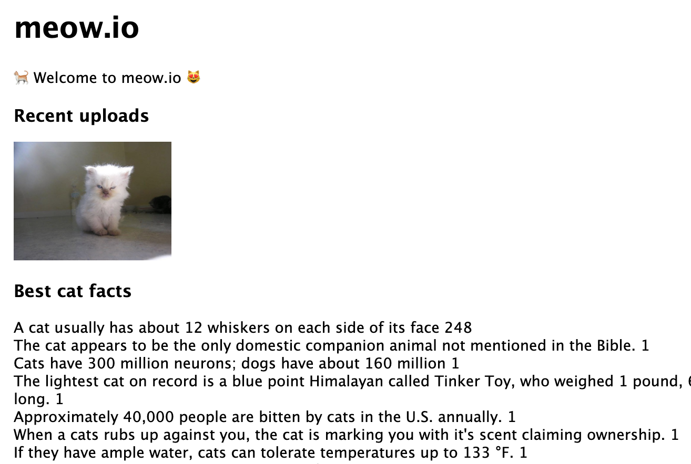

## Using caches and queues in meow.io

Part 1. [Setup and Overview](README.md)    
Part 2. [Using express and redis](Basics.md)     
Part 3. [Using caches and queues in meow.io](Meow.md) ⬅️   

### Meow.io

Now that you have a better handle on using express and redis, let's see if we do tasks on a simple app, meow.io.
This is a simple 3-tier node.js application, with a view, app layer, and database.



To run the application, perform the following steps:

```
# Setup app
cd meow.io
npm install 
node data/init.js

# Start server
npm start
```

You should be able to visit http://192.168.44.81:3000/

##### Task 3: Cache best facts calculation

The front page will load all cat facts and display the 100 most voted facts on each page load.
Without caching, this can add up with heavier traffic.

```
$ time ./load.sh 

real	0m20.373s
```

However, if we cache the results, we can greatly reduce this load.

```
$ time ./load.sh 

real	0m4.282s
```

Task: Modify `meow.io/routes/index.js` to cache and return the results of bestFacts. Have cached results expire after 10 seconds. You should see a reduction in load time for the site. 

Note: This is making an explicit trade-off between availability and consistency, since displayed data will be potentially 10 seconds behind real scores.

##### Task 4: Cat picture uploads storage
 
The front page will display the 5 most recently uploaded files (/upload).
You can use curl to help you upload files easily for test.

```bash
curl -F "image=@./data/morning.jpg" http://localhost:3000/upload
```

However, this is being read from the database on each page load. You could instead simply store the 5 most recently uploaded files in a cache without reading from the database.

Task: Modify the `meow.io/routes/upload.js` file to cache recently uploaded images. Modify the `meow.io/routes/index.js` to read from the cache instead the database.

##### Task 5: Regulate uploads with queue

meow.io is a huge success. You are now receiving a large volume of uploads, much faster than your poor database can handle.

Task: Modify the `meow.io/routes/upload.js` to store incoming images in a queue and not the database. Modify `meow.io/app.js` to timer (setInternal every 100ms), to pop images stored in the queue (consider using  [`LPOP`](https://redis.io/commands/lpop) ) and save in the database. This way, you can take advantage of the faster write speed for redis and drain the queue at a steady rate for longer term storage.